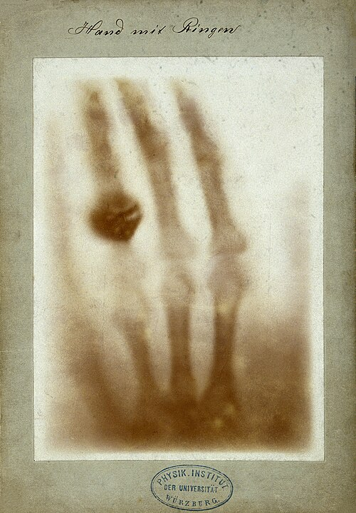

# A primer for analysing fMRI data

## What is fMRI data?

In 1895, Wilhelm Roentgen, a physics professor in Bavaria was testing whether cathode rays could pass through glass. His cathod tube, that shoots the light, was covered in black paper and yet he was able to see a light projected onto a nearby flourescent screen. He did not know what they were, so he simply called them "X"-rays. [Wikipedia link]

He also quickly realised that these could have a big impact in the medical space and the first known study he conducted of X-rays for medical purposes was to take a scan of his wife's hand, shown in figure 1.

This was one of the first breakthroughs that allowed us to peak inside our bodies to understand the anatomical structure. While this could provide a lot of details about the bones in body, trying to understand more about our brain required different mechanism altogether. 

The first studies of the brain actually came from analysing electrical signals from the brain. Hans Berger recorded the first human electroencephalograpgy (EEG) from scalp electrodes in 1924, which detects rhythmic electrical oscillations from the brain (he published his findings where he found the "Berger rhythm" which is now called the alpha wave which has a frequency of 8-12 Hz). It has become one of the primary tools for studying brain dynamics, seizure detection and sleep. It has a temporal resolution of milliseconds but cannot really provide any spatial resolution. 

The improvement in spatial resolution came from the development of MRI scans which were developed by Paul Lauterbur and Peter Mansfield in 1973. Moreover, this technique did not involve exposure to ionizing radiation making it much safer. The way in which MRI works is that it aligns hydrogen nuclei in a strong magnetic field and measure their relaxation back to baseline through the radio waves emitted during the relaxation. Typically this can enable spatial resolution of 1-3mm. This standard MRI looks like a photograph of the structure of the brain. In 2007 Lauterbur and Mansfield recieved the nobel prize in physiology or medicine for their discovery.

fMRI was invented in the 1990's by Seiki Ogawa and colleagues, who discovered that deoxyhemoglobin creates a detectbale MRI contrast. More specifically, deoxyhemoglobin and oxyhemoglobin have different magnetic properties and detecting this contrast is called the Blood Oxygen Level Dependent (BOLD) signal. 

When neurons fire (generate action potentials) in a brain region they consume oxygen and gluocose to power ion pumps and synaptic transmission. Metabolic activity increases locally in the activated region. Interestingly, the brain doesn't increase blood flow proporationally to oxygen demand, it overshoots it. Local blood flow increases by 20-40% but oxygen consumption increases by only 5%. This mismatch is crucial for the BOLD signal. Deoxyhemoglobin distorts the local magnetic filed around blood vessels, causing magnetic field inhomogeniety that dampens the MRI signal which is then detected. 

This showed that MRI scans could be used to map the functional signals in the brain, in addition to structural information. 

